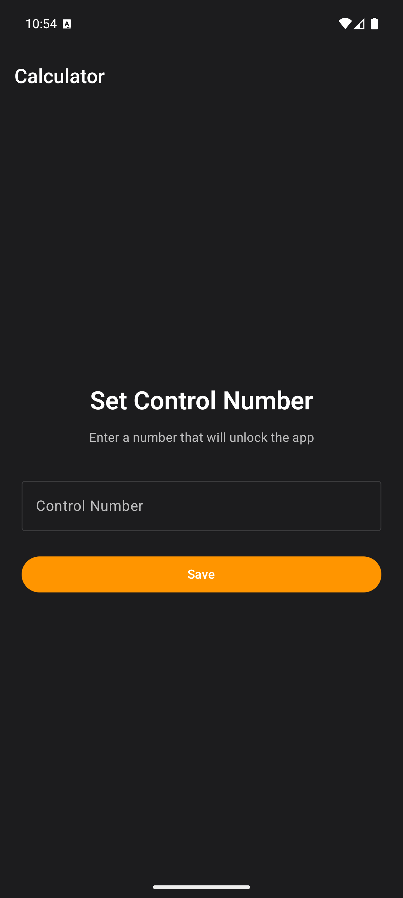
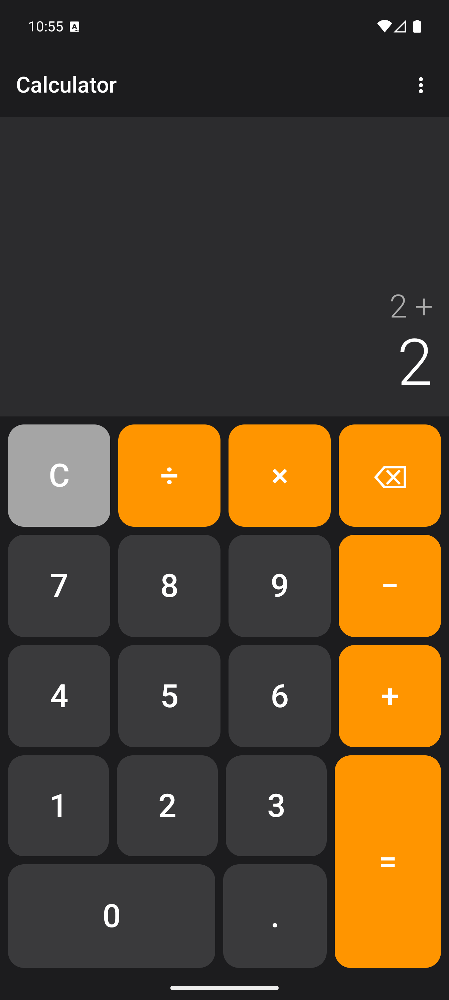
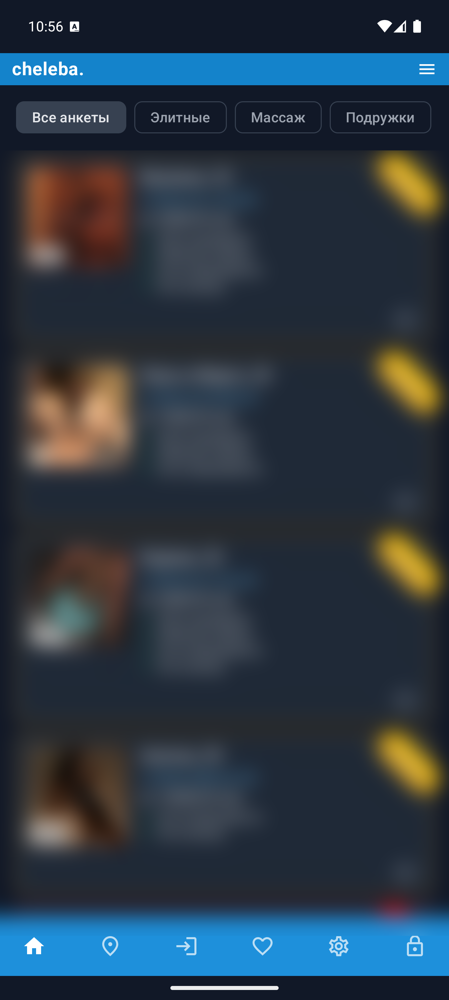

# Cheleba Mobile

Мобильное приложение для сайта [cheleba.top](https://cheleba.top) — каталог анкет с расширенными возможностями поиска, фильтрации и избранного.

## Скачать

**[Последняя версия](../../releases/latest)** | [Все релизы](../../releases)

## Особенности

### Приватность и маскировка

Приложение маскируется под обычный калькулятор. При запуске отображается полнофункциональный калькулятор, который можно использовать для обычных вычислений. Для доступа к основному функционалу необходимо ввести **контрольное число** — результат вычисления, который вы задаёте при первом запуске.

**Пример:** если вы установили контрольное число `1234`, введите в калькуляторе `1230+4=` или `1234*1=` — любое выражение с результатом `1234`.

  
  

### Автоматическая блокировка

- Приложение автоматически блокируется при сворачивании
- Настраиваемое время до блокировки (1-30 минут)
- Быстрая блокировка одной кнопкой из нижнего меню

## Функции

### Каталог анкет

- Просмотр анкет с фото и видео
- Категории: Все анкеты, Элитные, Массаж, Подружки
- Сортировка по различным параметрам
- Бесконечная прокрутка с подгрузкой

  

### Поиск и фильтры

- **Поиск** по имени, ID анкеты или номеру телефона
- **Фильтры:**
  - Ценовой диапазон
  - Возраст
  - Размер груди
  - Услуги
  - Наличие видео
  - Проверенное фото
  - Наличие отзывов

### Карта

- Просмотр анкет на интерактивной карте
- Кластеризация маркеров
- Быстрый переход к анкете

### Избранное

- Добавление анкет в избранное
- Локальное хранение (работает офлайн)
- Синхронизация при просмотре анкеты

### Детальный просмотр анкеты

- Галерея фотографий с полноэкранным просмотром
- Видеоплеер
- Информация о параметрах и услугах
- Отзывы и возможность оставить комментарий
- Звонок в один клик
- Местоположение на карте
- Похожие анкеты

### Авторизация

- Регистрация и вход
- Возможность оставлять отзывы (с защитой Yandex SmartCaptcha)
- Просмотр своих комментариев

### Настройки

- **Тема оформления:** Светлая / Тёмная / Как в системе
- **Автоблокировка:** включение и настройка таймера
- **Изменение контрольного числа**
- **Настройки каталога**
- **Проверка обновлений**

## Обновления

Приложение автоматически проверяет наличие новых версий при запуске и показывает уведомление, если доступно обновление. Также можно проверить вручную: **Настройки → Проверить обновления**.

## Системные требования

- Android 7.0 (API 24) и выше
- ~15 МБ свободного места

## Установка

1. Скачайте APK из [раздела релизов](../../releases/latest)
2. Разрешите установку из неизвестных источников
3. Установите APK
4. При первом запуске задайте контрольное число

## Безопасность

- Приложение не собирает и не передаёт личные данные
- Контрольное число хранится локально в зашифрованном виде
- Избранное хранится только на устройстве

---

  <b>cheleba.</b> 
  © 2024-2026

